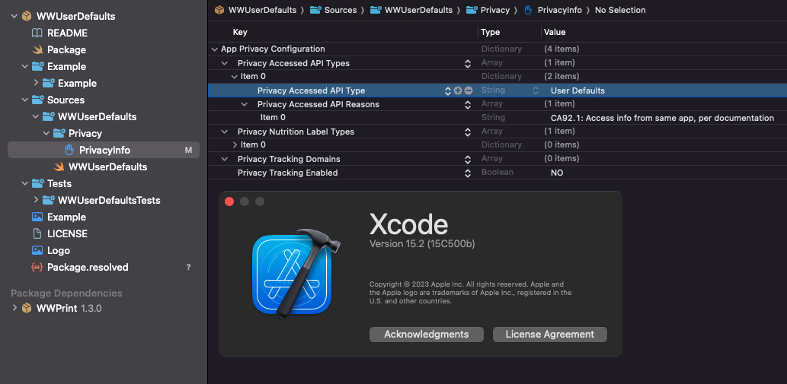
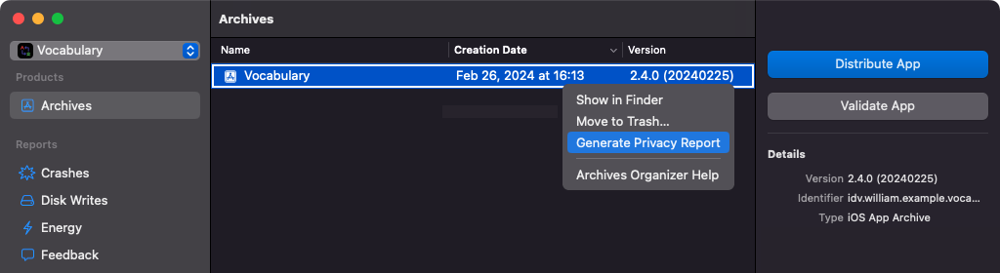
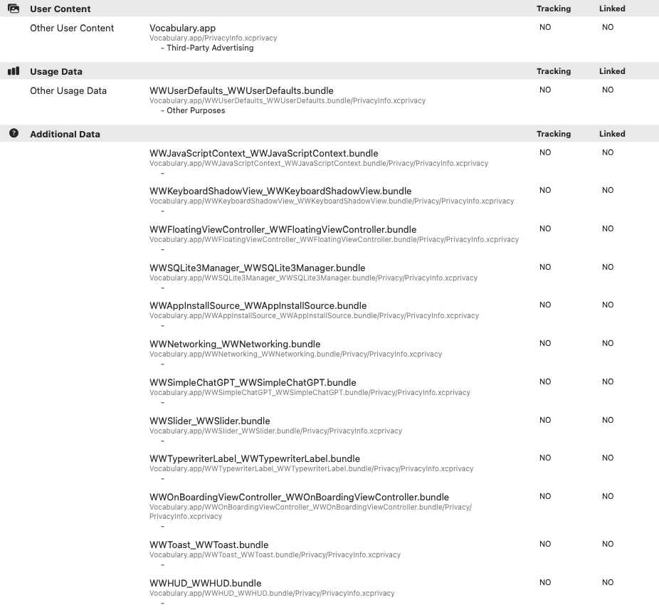

# [PrivacyInfo - Xocde 15 以上](https://juejin.cn/post/7260752483054600252)

 

## 新增隱私權文件
0. [快速掃描工具 - kimbely0320](https://github.com/kimbely0320/update_privacy_info.py)

1. 新增文件

2. 新增後會得到一個叫“PrivacyInfo.xcprivacy”的文件

## [隱私權文件設定](https://developer.apple.com/documentation/bundleresources/privacy_manifest_files)
1. [Privacy Tracking Enabled - NSPrivacyTracking](https://dev.fingerprint.com/docs/mobile-devices-understanding-privacy-manifest-files)
    - 就是你到底有沒有去追踨人家
    - 如果有, 請選YES / 沒有，請選NO

	

1. [Privacy Tracking Domains - NSPrivacyTrackingDomains](https://www.singular.net/blog/privacy-manifests/)
    - 追踨的資料是送到哪裡？
    - 比如說是：NoPrivacy.com

	

1. [Privacy Nutrition Label Types - NSPrivacyCollectedDataTypes]()
	- 到底收集了什麼資料呢？
	- 包含第三方套件

	

1. [Privacy Accessed API Types - NSPrivacyAccessedAPITypes](https://open.cmge.com/open/index/docDetail/81)
	- 使用了什麼有關個人資料的API
	- 其中包含大家關心的：NSUserDefault

	

	1. [Privacy Accessed API Type - NSPrivacyAccessedAPIType](https://developer.apple.com/documentation/bundleresources/privacy_manifest_files/describing_use_of_required_reason_api)
    	- 到底是用了哪一個API呢？
    	- 比如說：最常用NSUserDefault

		

	1. [NSPrivacyAccessedAPITypeReasons - Privacy Accessed API Reasons](https://docs.playernetwork.intlgame.com/docs/zh/Support/FAQ/iOS/iOSPrivacyManifest/)

		- 使用這個API的影響範圍
		- 比如說：測量用 / 存取資訊用 / 鍵盤資料用

		

## 使用
1. 在產生Report的時候，會跟第三方的隱私檔一起打包…

1. 如果使用Pods，又不能升到新版的話，直接加在Pods裡面就可以了…

1. 輸出的結果如圖所示…
